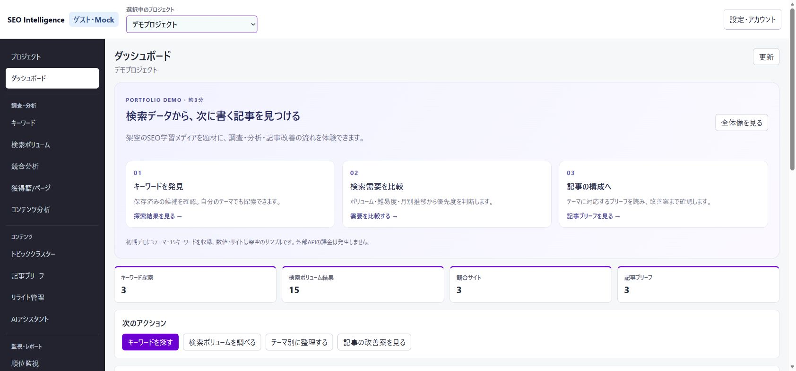

# ゲストポートフォリオの修正・検証記録

2026-09-27。[ブラウザ調査](guest-portfolio-review-2026-09-27.md)の指摘に対応した。変更はローカル作業ツリーにあり、本番へのデプロイ、コミット、push、PR作成は実施していない。

## 指摘への対応

| 指摘 | 修正 | 確認 |
|---|---|---|
| GPR-01 プロジェクトと結果の復元 | ゲストの選択をセッション内で保持。結果リンクにprojectId・jobIdを含め、所属と種別を検証する。新規作成後は自動選択 | 別プロジェクト作成→調査→再読み込みで選択・結果が維持。無効なIDや別プロジェクトの結果を拒否するテスト |
| GPR-02 保存済み探索が消える | 最新の探索結果を再表示し、探索履歴とダッシュボードから各結果へ戻れる | 探索→ダッシュボード→結果リンクで候補を復元。再探索のPOSTなしで読み込む回帰テスト |
| GPR-03 リライト理由が読めない | 全幅の一覧、日本語summary、折りたたみの根拠JSONに変更 | 一覧・詳細の日本語表示と、JSON内で日本語がUnicodeエスケープされないことを確認 |
| GPR-04 検索条件が無視される | 1〜24か月分の月別値を生成。難易度なしはnull。全期間を行内で展開可能 | ブラウザで3か月・難易度なし。1・3・24か月、範囲外0・25か月のテスト。モバイルで全12か月を表示 |
| GPR-05 一括調査への遷移が不明 | 完了通知に「検索ボリュームの結果を見る」を追加 | 候補5件を送信し、そのプロジェクトの結果5件へ遷移 |
| GPR-06 内部コードが残る | 獲得状況、検索意図、キーワードの役割・取得元、completed、地域・言語・算出日時を日本語表示 | ブラウザと表示の回帰テスト |

表示中の探索だけを候補語CSVへ出力する修正も追加した。初期データが増えても、別の探索を混ぜない。履歴には「CSV出力（キーワード候補）」「CSV出力（検索ボリューム）」を表示する。不正な結果URLで前の結果が残るケースと、複数サンプルの順位・獲得語・検索意図フィルターも検証した。

## 初期データと見せ方

「SEOの基礎」「キーワード選定」「コンテンツ改善」の3テーマを関連付けた。

| データ | 初期件数 |
|---|---:|
| 架空の自社サイト | 1 |
| キーワード候補 / 検索ボリューム | 各15 |
| 保存済み探索 / 一括調査 | 各3 |
| 競合 / 獲得ページ | 各3 |
| 獲得キーワード / 共起語 | 各9 |
| コンテンツ分析 / クラスター / 記事ブリーフ | 各3 |
| 順位結果 | 15 |
| リライト / カニバリ候補 | 3 / 1 |

- クラスター内に関連キーワード、記事候補、内部リンク候補を用意。ダッシュボードは実際のデモデータを集計する。
- ログイン画面ではサンプル入りデモを先に案内。プロジェクトとダッシュボードに約3分の体験導線を追加した。
- 指標の尺度とMock値であることを説明する。AIとレポートには「固定サンプル」と明示した完成イメージを用意し、実行・共有・通知は引き続き禁止する。
- 通常DBや外部APIへデータを登録しない。ゲストログイン時に毎回専用メモリ領域へ作成し、1時間の期限とセッション間の分離を維持する。



[モバイルの入口](guest-portfolio-fixes-2026-09-27/dashboard-mobile.png) / [月別推移の展開](guest-portfolio-fixes-2026-09-27/monthly-mobile.png) / [リライト](guest-portfolio-fixes-2026-09-27/rewrite.png)

## 検証結果

| 検証 | 結果 |
|---|---|
| ソリューションビルド | 成功、エラー0 |
| IntegrationTests全体 | 240成功・2スキップ（実Redis / PostgreSQLの接続条件なし） |
| 最終変更後のゲスト関連IntegrationTests | 56成功 |
| E2ETestsのBrowserE2E以外 | 89成功 |
| ゲストBrowserE2E（検証用Chromium） | 1成功。新規作成・選択復元・探索再表示・CSV保存と日本語内容・結果再表示・権限制御・ログアウト・別セッション分離・幅390pxを確認 |
| Edgeでの手動確認 | PCと幅390pxの表示、検索条件、結果導線、再読み込み、日本語表示、月別推移を確認 |
| git diff --check | 成功 |

実行コマンドの主要部分：

```powershell
dotnet build SeoIntelligence.sln --no-restore
dotnet test tests/IntegrationTests/IntegrationTests.csproj --no-build --no-restore
dotnet test tests/IntegrationTests/IntegrationTests.csproj --no-restore --filter 'FullyQualifiedName~GuestDemoSessionTests|FullyQualifiedName~GuestPortfolioTests|FullyQualifiedName~WebGuestLoginTests'
dotnet test tests/E2ETests/E2ETests.csproj --no-restore --filter 'Category!=BrowserE2E'
$env:E2E_GUEST_BROWSER_ENABLED = 'true'
$env:E2E_WEB_URL = 'http://localhost:5000'
dotnet test tests/E2ETests/E2ETests.csproj --no-build --no-restore --filter FullyQualifiedName~BrowserGuestLoginTests
git diff --check
```

今回の実行では既存のNuGetキャッシュを明示する`-p:NuGetPackageRoot=$env:USERPROFILE/.nuget/packages/`も付けた。NuGet監査情報の取得にはネットワーク制約によるNU1900警告があり、脆弱性情報の再取得は未確認。新しい依存パッケージは追加していない。

通常管理者向けBrowserE2Eも実行したが、5件は既定のlocalhost:5295が未起動、またはE2E_API_SERVICE_KEY未設定で失敗した。ゲストの検証には既存のWebAuthenticationFactoryを使う、通常DBから独立したメモリ内のローカルホストを起動した。既存ゲストE2Eは権限エラー画面に存在しない設定ボタンを探していたため、画面の「プロジェクト一覧へ戻る」を経由してログアウトするよう修正した。

Edge操作ツールではCSV受信イベントの完了を確認できなかった。アプリ側のCSV本文・スコープ検証に加え、Chromiumの実ブラウザテストでダウンロード成功を確認した。Edge固有の受信制限の原因は未確定で、セキュリティ設定は変更していない。

## 主な変更箇所

- `src/SeoIntelligence.Web/Services/GuestDemoSession*.cs`：初期データ、集計、検索条件、CSVの対象制限。
- `ProjectSelectionState.cs`、`GuestApiRouter.cs`、`ResearchResultLinks.cs`：プロジェクト復元と結果への導線。
- `Components/Pages/`の探索・ボリューム・リライト等と`UiText.cs`：結果の再表示、読みやすさ、日本語表示。
- `Components/Common/DemoWalkthrough.razor`、`DemoMetricGuide.razor`、`JobProgressPanel.razor`、`wwwroot/app.css`：入口、指標説明、履歴と表示。
- `tests/IntegrationTests/GuestPortfolioTests.cs`ほか関連テスト、`docs/guest_login.md`、`docs/screen_design.md`。

本番で確認する際は、この変更を反映した後に新しくゲストログインして初期データを確認する。

## レビュー後の追加修正

コードレビューの指摘に対応した。先に失敗するテストを追加し、修正後に成功することを確認した。

| 指摘 | 対応 |
|---|---|
| プロジェクト作成フォームの既定値が旧コード`jp` / `ja`に戻っていた。通常ログインでも、リライト候補が地域・言語の完全一致で指標を探すため、新規プロジェクトで一致しなくなる | `Japan` / `Japanese`へ戻した。ゲストの地域・言語マスタと初期プロジェクトも同じ正準名にそろえ、ゲストで`Japan`のプロジェクトを作ると選択肢に「日本」が二重に並ぶ問題も解消した |
| 探索画面を開くと、通常ログインでも最新の探索結果を自動で読み込んでいた | 検索ボリューム画面と同じくゲストだけにした。通常ログインは履歴の「結果を開く」から開く |
| 別セッションとの分離テストのアサーションが常に成功する形だった | 別セッションから他セッションのプロジェクトを選べないことを確認する形にした。実装を一時的に壊すと失敗することも確認した |
| 候補語CSVの`jobId`による限定がゲストMockにしかない | 差異として`guest_login.md`に記録した。通常ログイン側の対応は別Issueとする |
| 細部 | `FormatJson`のシリアライザ設定を静的に保持した。ログイン画面・案内・レポート例の件数は初期データの定義から表示し、表示と一致することをテストする。「全3 か月」の空白を削除した |

### 通常ログインへの影響

今回の変更のうち、ゲスト以外にも効くものは次のとおり。

- プロジェクトを作成すると、そのプロジェクトを自動で選択する。選択できるのは一覧にある有効なプロジェクトだけ。
- 探索・検索ボリュームの履歴とダッシュボードに「結果を開く」を表示し、`projectId`付きURLでプロジェクトと結果を復元する。失敗したジョブにも表示する。
- 探索画面に「保存済みの探索を開く」、検索ボリューム画面の「過去の調査を開く」に履歴一覧を追加した。候補語から一括調査へ送った後は結果へのリンクを表示する。
- 検索ボリュームの結果に月別推移の折りたたみを追加し、一覧の月別欄は月数と直近月の表示にした。
- ダッシュボードの次のアクションにクラスター・リライトへの導線を追加し、直近の調査・出力を6件表示にした。
- リライト管理は一覧を全幅にし、選定理由をsummaryの本文と折りたたみの根拠JSONで表示する。
- 獲得状況、検索意図、役割、完了状態、地域、言語、算出日時を日本語で表示する。
- ログイン画面は、サンプル入りデモの案内を管理者ログインの前に表示する。

### 追加修正の検証

| 検証 | 結果 |
|---|---|
| ソリューションビルド | 成功、警告0・エラー0 |
| UnitTests / ContractTests | 50成功 / 88成功 |
| IntegrationTests全体 | 242成功・2スキップ（実Redis / PostgreSQLの接続条件なし） |
| E2ETestsのBrowserE2E以外 | 91成功 |
| slopwatch（変更ファイル、ベースラインなし） | 新たな検出なし。`SearchVolume.razor`のキャンセル時の`catch (OperationCanceledException) when (...) { }`が検出されたが、HEAD時点から存在する意図的な停止処理で今回の変更範囲外 |

コミット・PR作成時は、GPR-01〜06の修正と、初期データ・案内・サンプル表示の2つに分ける想定。

### 追加修正後のブラウザ再検証

2026-09-27、前回の検証で起動したPreviewプロセスの実行パスを確認して停止し、最新のソースからローカルプレビューを再起動した。実際の待受先は`http://localhost:5000`。通常DBとは独立したメモリ内テストホストであり、本番環境への反映は行っていない。

```powershell
$env:E2E_GUEST_BROWSER_ENABLED = 'true'
$env:E2E_WEB_URL = 'http://localhost:5000'
dotnet test tests/E2ETests/E2ETests.csproj --no-restore --filter FullyQualifiedName~BrowserGuestLoginTests -p:NuGetPackageRoot=$env:USERPROFILE/.nuget/packages/ --verbosity minimal
git diff --check
```

- ゲストBrowserE2E：1成功、0失敗、0スキップ。プロジェクト作成後の自動選択と再読み込み後の保持、探索結果リンク、実際のCSVダウンロード（日本語・Mock表記）、検索ボリューム結果の再表示、管理画面のアクセス拒否、ログアウト、別セッションとの分離を確認した。
- Edgeでの実操作：初期探索結果の自動表示、地域の選択肢が`日本 / Japan`の1件、言語が`日本語 / Japanese`の1件であることを確認した。
- 集計月数3・SEO難易度取得オフで実行し、難易度が`-`、月別表示が`月別推移（全3か月）`、2026年6〜8月の3件になることを確認した。
- 390×844の表示で結果カードと月別推移を確認した。ページ幅375pxに対しビューポート390pxで、横方向のはみ出しはなかった。
- リライトの根拠JSONが日本語のまま読めること、ログイン・案内の3テーマ／15キーワード、レポート例の15キーワード／3競合／3ブリーフを確認した。
- ダッシュボードのデータと案内が表示されることを目視確認した。下記の画面証跡では追加の調査を3回実行済みのため、検索ボリューム結果は初期15件に3件を加えた18件。

証跡：[最新版ダッシュボード](guest-portfolio-fixes-2026-09-27/followup-dashboard.png)、[3か月指定のモバイル結果](guest-portfolio-fixes-2026-09-27/followup-monthly-mobile.png)。

この再検証ではアプリのソースは変更していない。上記の全テスト一式と管理者向けBrowserE2Eは再実行していない。通常ログイン側のCSV絞り込み対応、本番反映、コミット・PRは今回の再検証に含まない。
